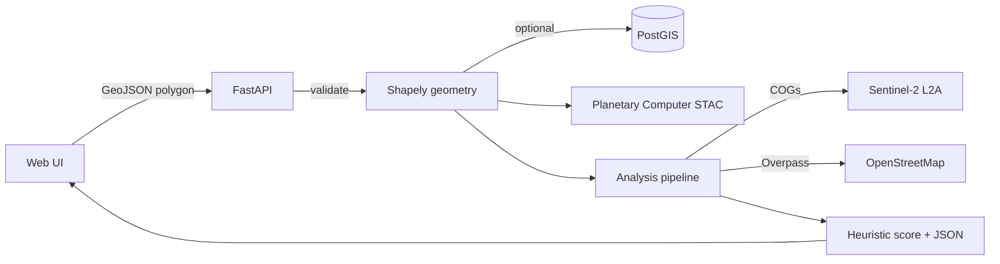

# ClimateRisk Sentinel

**Climate-risk and infrastructure intelligence** from a single **area of interest (AOI)**: validate geometry, discover **Sentinel-2** scenes, compute **open-data** surface and proximity proxies, and return an **explainable heuristic** screening index — not a calibrated damage or financial loss model.

This repository is a small **monorepo** designed to be **reviewer-friendly**: thin HTTP routes, services for geospatial and STAC logic, a straight-line React UI, and tests on the analysis math.

---

## What it does

1. **Accepts a WGS84 polygon** (pasted coordinates or map draw) and **normalizes/validates** it server-side (Shapely).
2. **Optionally stores** the AOI in **PostGIS** if the database is up.
3. **Queries the Microsoft Planetary Computer** public **STAC** API for `sentinel-2-l2a` items with **fixed, reproducible** search parameters and short-lived in-process caching.
4. **Runs a deterministic analysis pipeline** (when the AOI is within a configurable area cap): mean **NDVI / NDWI / NDBI**-style indices from COGs, **OpenStreetMap**-based road length and nearest waterway, **ΔNDVI** when two distinct acquisitions are available, and a **documented weighted heuristic score (0–100)** with narrative and caveats.
5. Serves a **React + Leaflet** UI: map + workflow + indicator dashboard + JSON/text export.

---

## Why it exists

Many teams need a **credible first pass** on “what does open data say about this footprint?” before investing in proprietary models. ClimateRisk Sentinel is intentionally **modest**: it **does not** claim prediction of insured loss, structural failure, or event timing. It **does** surface **reproducible, cited indicators** and **explicit limitations** so technical reviewers can trust the chain of reasoning in minutes.

---

## How it works (architecture)

| Layer | Role |
| --- | --- |
| `frontend/` | React, Leaflet, Tailwind. Calls `/api/...` (Vite dev server proxies to the backend). |
| `backend/app/api/routes` | FastAPI handlers — validation, persistence, STAC search, analysis run. |
| `backend/app/schemas` | Pydantic request/response models. |
| `backend/app/services` | Geometry, STAC + cache, and `services/analysis/*` (raster readout, OSM, risk heuristic, pipeline). |
| `backend/app/db` | SQLAlchemy + GeoAlchemy2 models for optional AOI storage. |

High-level flow:



---

## Datasets and libraries

**Data (all public; no commercial map or geocoding APIs in the default path)**

| Source | Use |
| --- | --- |
| [Microsoft Planetary Computer](https://planetarycomputer.microsoft.com/) | STAC catalog and signed **Sentinel-2 L2A** COG assets for index statistics. |
| [OpenStreetMap](https://www.openstreetmap.org/) (via Overpass) | Road network length in AOI context, nearest mapped linear waterways. |
| [OpenStreetMap](https://www.openstreetmap.org/copyright) tiles | Basemap in the UI. |

**Backend (see `backend/pyproject.toml`)**

- **API & runtime:** FastAPI, Uvicorn, Pydantic, SQLAlchemy, Psycopg, GeoAlchemy2  
- **Geospatial stack:** Shapely, PyProj, GeoPandas, Rasterio, Xarray, NumPy  
- **STAC & PC:** pystac-client, planetary-computer, httpx  

**Frontend (see `frontend/package.json`)**

- React, Vite, TypeScript, Tailwind CSS, Leaflet, react-leaflet, leaflet-draw  

---

## Current limitations (read before production use)

- **Heuristic index only** — The 0–100 score is a **transparent blend of proxies**, not a calibrated probability of flood, fire, or loss.
- **AOI size caps** — Very large areas skip raster downloads; the API **partial analysis** path and `caveats` explain what was skipped (`max_aoi_area_km2`, `analysis_max_aoi_area_km2` in `backend/app/config.py`).
- **Data completeness** — OSM varies by region; “no waterway” may mean **no data**, not absence of water. The API carries **caveats** per run.
- **Two-scene comparison** — ΔNDVI needs **two usable** distinct acquisitions; cloud cover and processing failures can leave a single scene or no scenes.
- **No auth by default** — The stack is for **local / controlled** review and demos. Add auth, rate limits, and hardening before internet exposure.
- **In-process cache** — STAC metadata cache is per process and **not** shared across workers.

---

## Run locally

**Prerequisites:** Python **3.11+** ([uv](https://docs.astral.sh/uv/) recommended), Node **20+**, **Docker** optional (PostGIS).

### 1. Optional: database

```bash
docker compose up -d
```

Copy `.env.example` to `backend/.env` and adjust if needed. Without Postgres, **validation, STAC search, and analysis still work**; **saving** an AOI returns 503.

### 2. Backend

```bash
cd backend
cp ../.env.example .env   # or: copy ..\.env.example .env  (Windows)
uv sync
uv run uvicorn app.main:app --reload --host 127.0.0.1 --port 8000
```

- OpenAPI: [http://127.0.0.1:8000/docs](http://127.0.0.1:8000/docs)  
- Health: `GET /api/v1/health`  

| Method | Path | Purpose |
| --- | --- | --- |
| GET | `/api/v1/health` | Liveness + `database` flag |
| GET | `/api/v1/version` | Build/version metadata |
| POST | `/api/v1/aoi/validate` | Normalize & validate polygon |
| POST | `/api/v1/aoi/` | Persist AOI (503 if DB down) |
| GET | `/api/v1/aoi/{id}` | Load stored AOI |
| POST | `/api/v1/datasets/search` | STAC search (`geometry` **xor** `aoi_id`) |
| POST | `/api/v1/analysis/run` | Indicators + heuristic (`geometry` **xor** `aoi_id`) |

### 3. Frontend

```bash
cd frontend
npm install
npm run dev
```

Open [http://127.0.0.1:5173](http://127.0.0.1:5173). The Vite config **proxies `/api`** to `http://127.0.0.1:8000`.

**Production build:** `npm run build` then serve `frontend/dist` behind your reverse proxy, with `/api` routed to the same FastAPI host.

### 4. Tests (backend)

```bash
cd backend
uv run pytest
```

---

## UI overview (demo asset)

A **non-photographic** layout diagram is in [`docs/screenshots/ui-overview.svg`](docs/screenshots/ui-overview.svg) for slides and reviews. Replace or supplement with real PNG captures if you need marketing screenshots; see `docs/screenshots/README.md`.

---

## Repository layout (reviewer map)

```text
backend/app           FastAPI app, config, services, db
backend/tests         Unit tests for analysis helpers
frontend/src          React UI, hooks, API client, map
docs/screenshots      Optional UI captures and the overview SVG
.env.example          Copy to backend/.env
docker-compose.yml    Optional PostGIS
```

For contribution and code quality expectations, see [CONTRIBUTING.md](CONTRIBUTING.md).

---

## License and attribution

- Basemap and OSM-derived data: **OpenStreetMap contributors** ([ODbL](https://www.openstreetmap.org/copyright)).  
- Satellite metadata and assets: **Microsoft Planetary Computer** / **Sentinel-2** usage subject to their terms.  
- Add your preferred **project license** when you open-source publicly.
