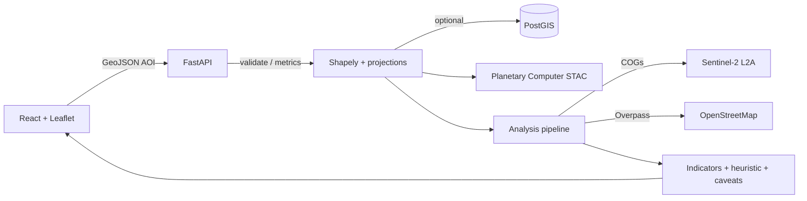

# ClimateRisk Sentinel

**Open-data geospatial intelligence for a single footprint.** ClimateRisk Sentinel validates an area of interest (AOI), queries public catalogs, computes surface indices and infrastructure proxies from **Sentinel-2** and **OpenStreetMap**, and returns **explainable outputs**—including a **documented heuristic screening index (0–100)** that is **not** a predictive damage model or loss estimator.

---

## At a glance

| | |
| --- | --- |
| **What it does** | Turns a WGS84 polygon into normalized geometry metadata, STAC-backed scene discovery, raster statistics (e.g. NDVI / NDWI / NDBI-style means), OSM-derived infrastructure metrics, optional ΔNDVI across two acquisitions, and a weighted **screening** score with narratives and caveats. |
| **Why it exists** | Teams need a **fast, reproducible first read** on “what does open data say here?” before investing in proprietary models or field work. The stack favors **traceability** and **honest limits** over headline scores. |
| **Who it’s for** | Engineers and analysts reviewing climate-adjacent exposure; **technical due diligence** and demos; anyone who values **cited indicators** and explicit uncertainty over black-box “risk numbers.” |

---

## Architecture (overview)

| Area | Stack & responsibility |
| --- | --- |
| **Frontend** | **React**, **Vite**, **TypeScript**, **Tailwind**. **Leaflet** + **react-leaflet** + **leaflet-draw** for AOI sketching and map context; dashboard and export UI call the API via the Vite dev proxy. |
| **Backend** | **FastAPI** + **Pydantic** — thin HTTP layer, OpenAPI at `/docs`. **SQLAlchemy** + **GeoAlchemy2** + **Psycopg** for optional AOI persistence when PostGIS is available. |
| **Spatial analysis** | **Shapely** / **GeoPandas** for geometry; **Rasterio** + **Xarray** + **NumPy** for Cloud-Optimized GeoTIFF readouts inside the AOI; **PyProj** for equal-area metrics. Pipeline code lives under `backend/app/services/analysis/`. |
| **Public data pipeline** | **pystac-client** against **Microsoft Planetary Computer** STAC (`sentinel-2-l2a`), signed reads via **planetary-computer**; **Overpass** for OSM ways in/near the AOI. Short-lived **in-process caches** for STAC metadata and analysis (see `backend/app/config.py`). |

High-level flow:



---

## Core capabilities

| Capability | Notes |
| --- | --- |
| **AOI workflows** | Paste coordinates or draw a polygon; server-side normalization, ring closure, validity checks, and **area caps** with clear errors. Optional save to PostGIS when the DB is up. |
| **STAC search** | Fixed, reproducible search parameters against Planetary Computer (`sentinel-2-l2a`), rolling datetime window or optional preset, cloud-cover filter — surfaced with caching behavior documented in config. |
| **Raster analytics** | Mean **NDVI / NDWI / NDBI**-style indices over masked pixels for selected scenes; **partial analysis** when AOI or runtime limits apply — always reflected in **`caveats`**. |
| **Infrastructure metrics** | OSM-based **road length** context and **nearest mapped waterway** distance — interpreted as **proxies**, not ground-truth hydrology. |
| **Heuristic screening** | Weighted **0–100 index** from documented inputs (e.g. vegetation change signal, water proximity, infrastructure context). **Explainable and bounded** — **not** a calibrated hazard or catastrophe model. |

---

## Screenshots & visuals

Use these for decks, README polish, and onboarding—replace placeholders as you capture real UI.

| Asset | Use |
| --- | --- |
| [`docs/screenshots/ui-overview.svg`](docs/screenshots/ui-overview.svg) | **Diagrammatic** map + dashboard + workflow layout (non-photographic). |
| *Optional PNGs* | Add under `docs/screenshots/` (e.g. `map-aoi-2026-05.png`, `dashboard-indicators.png`) — map with validated AOI, indicator dashboard with caveats visible, export panel. See [`docs/screenshots/README.md`](docs/screenshots/README.md). |

**Suggested capture checklist**

1. **Map** — AOI drawn or pasted, footprint bbox / optional NDVI visual context layer.  
2. **Dashboard** — indicators table + temporal block when two scenes exist.  
3. **Workflow** — validate → analyze path with honest copy visible.  

---

## Technical decisions

| Choice | Rationale |
| --- | --- |
| **Microsoft Planetary Computer** | Public **STAC** API, **signed** access to **Sentinel-2 L2A** COGs—no proprietary imagery hosting; reproducible catalog semantics for reviewers. |
| **Heuristic scoring** | A **transparent blend** of proxies with component notes beats an opaque “score.” Not presented as ML inference or return-period hazard—**screening and triage** only. |
| **Open-source stack** | **FastAPI**, **React**, **Leaflet**, **PostGIS** — deployable without a paid maps platform; code and dependencies are **auditable** for technical stakeholders. |
| **Leaflet** | Lightweight 2D maps, OSM-friendly, **no Mapbox-style** lock-in for the default path. |
| **PostGIS** | Optional **AOI persistence** and spatial types when you want multi-session workflows; core APIs still run without DB. |
| **FastAPI** | Native OpenAPI, Pydantic validation, straightforward sync/async routes for I/O-heavy analysis. |

---

## Limitations (read before relying on outputs)

- **Not a catastrophe or hazard model** — Outputs are **proxies** from open data, not engineering-grade flood, fire, or wind fields.  
- **Not insured loss or financial prediction** — The heuristic index is **not** a pricing, underwriting, or loss-cost estimate.  
- **Open-data caveats** — OSM completeness varies by region; “no waterway” may mean **no mapped feature**, not absence of risk. Planetary Computer and scene availability depend on **cloud cover**, processing, and **AOI size** limits.  
- **Raster limits** — Large AOIs may skip or shrink raster work; **`partial_analysis`** and **`caveats`** describe what ran. ΔNDVI needs **two distinct** usable acquisitions.  
- **Operations** — No auth by default; STAC/analysis caches are **in-process**. Harden for production (auth, rate limits, shared cache or workers as needed).

---

## Local setup

**Prerequisites:** Python **3.11+** ([uv](https://docs.astral.sh/uv/) recommended), Node **20+**, **Docker** optional (PostGIS).

### Optional: database (PostGIS)

```bash
docker compose up -d
```

Then ensure `database_url` in `backend/.env` matches the compose service (see `.env.example`).

### Environment

Copy the example env and tune for your machine:

```bash
cp .env.example backend/.env
```

Key variables (see `backend/app/config.py` for full list): `DATABASE_URL` / `database_url`, STAC catalog URL, datetime preset vs rolling lookback, AOI and analysis area caps, Overpass endpoint, CORS (`cors_origins` for non-local frontends).

Without Postgres, **validate**, **STAC search**, and **analysis** still work; **persist AOI** (`POST /api/v1/aoi/`) returns **503** if the DB is unavailable.

### Backend

```bash
cd backend
uv sync
# Optional: tests & lint
uv sync --extra dev

uv run uvicorn app.main:app --reload --host 127.0.0.1 --port 8000
```

- OpenAPI: [http://127.0.0.1:8000/docs](http://127.0.0.1:8000/docs)  
- Health: `GET /api/v1/health`

### Frontend

```bash
cd frontend
npm install
npm run dev
```

Open [http://127.0.0.1:5173](http://127.0.0.1:5173). Vite **proxies `/api`** to `http://127.0.0.1:8000`.

**Production:** `npm run build` → serve `frontend/dist` behind a reverse proxy; route **`/api`** to the same FastAPI host.

### Tests (backend)

```bash
cd backend
uv sync --extra dev
uv run python -m pytest
```

---

## API surface (quick reference)

| Method | Path | Purpose |
| --- | --- | --- |
| GET | `/api/v1/health` | Liveness + `database` flag |
| GET | `/api/v1/version` | Build/version metadata |
| POST | `/api/v1/aoi/validate` | Normalize & validate polygon |
| POST | `/api/v1/aoi/` | Persist AOI (503 if DB down) |
| GET | `/api/v1/aoi/{id}` | Load stored AOI |
| POST | `/api/v1/datasets/search` | STAC search (`geometry` **xor** `aoi_id`) |
| POST | `/api/v1/analysis/run` | Indicators + heuristic (`geometry` **xor** `aoi_id`) |

---

## Repository layout

```text
backend/app           FastAPI app, config, services, db
backend/tests         Focused tests (geometry, heuristics, API smoke)
frontend/src          React UI, hooks, API client, map
docs/screenshots      UI overview SVG; optional PNG captures
.env.example          Copy to backend/.env
docker-compose.yml    Optional PostGIS
```

Contribution guidelines: [CONTRIBUTING.md](CONTRIBUTING.md).

---

## License and attribution

- **OpenStreetMap** contributors ([ODbL](https://www.openstreetmap.org/copyright)) — tiles and derived OSM queries.  
- **Microsoft Planetary Computer** / **Sentinel-2** — use subject to their terms.  
- Add your **project license** when publishing publicly.
